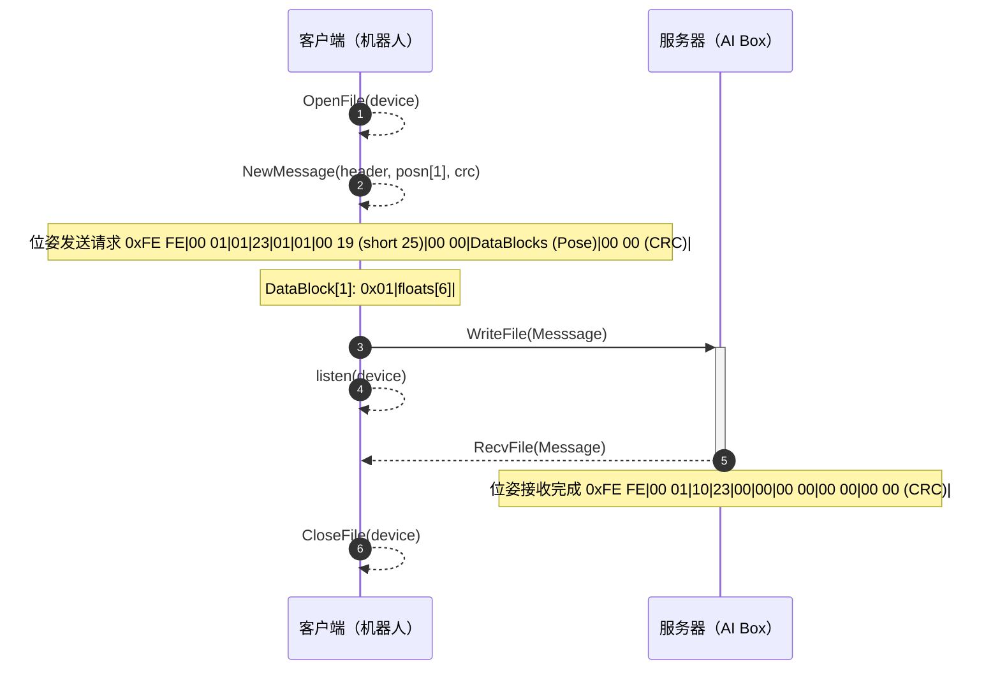

## 网络套接字报文格式定义

#### 通用报文结构定义（Message）

网络套接字报文结构由三部分信息段构成，分别为：报文头（固定）、数据块（可变）、校验码（固定）。

- **成员列表：**
  
  | 成员                   | 类型          | 预定义赋值(0x) | 描述                                                         |
  | :--------------------- | :------------ | :------------- | :----------------------------------------------------------- |
  | 报文头                 | header type   | /              | 唯一标识报文的服务信息段                                     |
  | 数据块                 | block type[n] | /              | 可变序列长度的数据信息段                                     |
  | 循环冗余检测（校验码） | short         | /              | 用于校验报文在传输过程中是否出错，UDP协议中使用，TCP协议中使用缺省值 |
  |                        |               | 00 00          | 缺省值                                                       |
  
- **成员关系：**
  
  ```mermaid
  classDiagram
      class 报文信息 ~messsages type~ {
          +报文头: header type
          +数据块: block type[n]
          +循环冗余校验: short
      }
      报文信息 "1"*-- "1" 报文头 ~header type~ : 组成
      报文信息 "1"*-- "1" 数据块 ~block type[n]~ : 组成
  ```

#### 1. 报文头（Message Header）

用于标识服务信息的固定报文分段，在通讯请求和响应任务中都会使用。主要提供的服务信息包括：协议版本、传输类型，读写操作标识，错误码等。

- **功能：**
  
  - 保持通讯协议版本一致性；
  - 验证传输方向正确；
  - 通过动作标识实现数据信息交互操作；
  - 验证交互操作的异常并交互。
  
- **成员列表：**
  
  | 成员       | 类型  | 预定义赋值(0x) | 描述                                                         |
  | :--------- | :---- | :------------- | :----------------------------------------------------------- |
  | 起始字     | short | FE FE          | 标识报文起始                                                 |
  | 版本号     | short | 00 01          | 标识报文协议主版本和子版本                                   |
  | 传输类型   | char  | /              | 标识信息传输类型                                             |
  |            |       | 01             | 客户端（机器人）至服务器（AI Box）                           |
  |            |       | 10             | 服务器（AI Box）至客户端（机器人）                           |
  | 动作标识   | char  | /              | 标识信息交互操作                                             |
  |            |       | 00             | 无动作                                                       |
  |            |       | 01             | 客户端（机器人）CycleOn（检测就绪）请求，服务器（AI Box）CycleOn（检测就绪）完成 |
  |            |       | 02             | 客户端（机器人）CycleOff（检测终止）请求，服务器（AI Box）CycleOff（检测终止）完成 |
  |            |       | 23             | 客户端（机器人）当前位姿pose发送请求，服务器（AI Box）位姿接收完成 |
  |            |       | 24             | 客户端（机器人）寄存器位姿数据发送请求，服务器（AI Box）寄存器位姿数据接收完成 |
  |            |       | 25             | 客户端（机器人）容差值tolerance发送请求，服务器（AI Box）容差值接收完成 |
  |            |       | **26**         | **客户端（机器人）发送程序索引号（程序索引号与工件对应），服务器（AI Box）返还消息如果包含索引号，表示服务器准备就绪，如果客户端回复409时，表示服务器尚未准备好** |
  |            |       | **27**         | **客户端（机器人）发送视觉检测结果获取请求，服务器（AI Box）返还视觉检测结果码** |
  | 数据块类型 | char  | /              | 标识数据块类型                                               |
  |            |       | 00             | 空数据块                                                     |
  |            |       | 01             | 位姿数据pose                                                 |
  |            |       | 02             | 检测容差值tolerance                                          |
  |            |       | **03**         | **程序索引号ProgIdx/视觉检测结果码ResultCode**               |
  | 数据块数量 | char  | XX             | 标识数据块总数                                               |
  | 数据块长度 | short | XX XX          | 标识每个数据块的长度                                         |
  | 错误码     | short | /              | 标识交互操作的异常类型和异常序号                             |
  |            |       | 0000           | 无错误                                                       |
  |            |       | 0001           | AI Box的CycleOn检测未就绪                                    |
  |            |       | 0002           | AI Box的CycleOff检测终止未正确关闭                           |
  |            |       | 1001           | AI Box的位姿pose数据未收到或者解析错误                       |
  |            |       | 1002           | AI Box的容差值tolerance数据未收到或者解析错误                |
  
  注：报文头总长度为：2+2+1+1+1+1+2+2=12（字节），为定长字节序列
  
- **成员关系：**
  
  ```mermaid
  classDiagram
      class 报文头 ~header type~ {
          +起始字: short
          +版本号: short
          +传输方向: char
          +动作标识: char
          +数据块类型: char
          +数据块数量: char
          +数据块长度: short
          +错误码: short
      }
  ```

#### 2. 数据块（Data Block，单个定义）

用于承载数据信息的可变报文分段，在响应任务中使用。主要提供的数据信息包括：位姿数据列表及其他未来可扩展的数据列表。

- **功能：**
  
  - 传输确定数量的若干组数据信息。
  
- **成员列表：**
  
  | 成员     | 类型     | 预定义赋值(0x) | 描述                               |
  | :------- | :------- | :------------- | :--------------------------------- |
  | 索引号   | char     | XX           | 标识数据的序列索引编号 |
  | 机器人位姿pose   | float[6] | /（可缺省）    | 标识对象在三维笛卡尔坐标系下的位姿 x; y; z; w; p; r; |
  | 视觉检测容差值tolerance | float    | /（可缺省）    | 标识对象的检测容差值                                 |
  | 程序索引号ProgIdx/视觉检测结果码ResultCode | int | /（可缺省） | 程序索引号ProgIdx对应工件信息；视觉检测结果码对应结果状态 |
  
  注：索引号是为了标识当前数据是第几个数据块，不可缺省值，以避免数据在传输时，数据块顺序发生错误，索引号从0x00开始，0x00代表第一个DataBlock。
  
  **程序索引号ProgIdx（国新项目临时定义，根据具体项目实施调整工件信息）：**
  
  | ProgIdx数值 | 工件信息         |
  | ----------- | ---------------- |
  | 0           | 车型E131，前风挡 |
  | 1           | 车型E131，后风挡 |
  | 2           | 车型E311，前风挡 |
  | 3           | 车型E311，后风挡 |
  | ......      | ......           |
  
  **视觉检测结果码ResultCode：**
  
  | ResultCode | 结果码输出端 | 状态码信息                                                   | KAREL报警信息                                               |
  | ---------- | ------------ | ------------------------------------------------------------ | ----------------------------------------------------------- |
  | 0          | 客户端       | 客户端初始时将寄存器设置为空的结果码                         | 无                                                          |
  | 1          | 服务器       | Cycle检测判定为OK                                            | 无                                                          |
  | 2          | 服务器       | Cycle检测判定为NG                                            | 无                                                          |
  | 10         | 服务器       | Cycle检测判定为OK，但是视觉检测程序以外程序出现故障（如数据库） | 服务器数据库掉线（Server database is offline）              |
  | 20         | 服务器       | Cycle检测判定为NG，但是视觉检测程序以外程序出现故障（如数据库） | 服务器数据库掉线（Server database is offline）              |
  | 202        | 服务器       | 服务器（AI Box/上位机）已经接收请求，但是尚未处理完毕        | 服务器未处理完成（Server is busy）                          |
  | 400        | 服务器       | 客户端（机器人）发送的语义有误，当前请求无法被服务器理解。   | 机器人通讯消息语义错误（Robot communication message error） |
  | 404        | 客户端       | 客户端（机器人）发送的请求未收到响应，超时退出               | 服务器掉线（Server is offline）                             |
  | 409        | 服务器       | 服务器（AI Box/上位机）被请求的资源的当前状态之间存在冲突，请求无法完成。 | 服务器资源冲突（Resource conflict on server access）        |
  
- **成员关系：**
  
  ```mermaid
  classDiagram
      class 数据块 ~Data Block~ {
          +索引号: char
          +位姿pose: float[6]
          +容差值tolerance: float
          +程序索引号ProgIdx/视觉检测结果码ResultCode: int
      }
  ```

---

## 网络套接字通讯时序

#### 建立/断开连接：

- **建立套接字连接：**
  
  ```mermaid
  sequenceDiagram
      autonumber
      participant 客户端（机器人）
      participant 服务器（AI Box）
  
      客户端（机器人） -->> 客户端（机器人）: Bind(device, ip, port)
      客户端（机器人） ->>+ 服务器（AI Box）: Connect(device, status)
      loop 建立连接
          alt 连接拒绝
              客户端（机器人） -->> 客户端（机器人）: Return(host_error)
          else 连接超时
              客户端（机器人） -->> 客户端（机器人）: Return(Timeout())
          end
          服务器（AI Box） ->>- 客户端（机器人）: Connect Success
      end
  
      opt ping请求
          客户端（机器人） ->>+ 服务器（AI Box）: Ping(device, status)
          alt ping异常
              客户端（机器人） -->> 客户端（机器人）: Return(ping_error)
          end
          服务器（AI Box） ->>- 客户端（机器人）: Ping Success
      end
  ```
- **断开套接字连接：**
  
  ```mermaid
  sequenceDiagram
      autonumber
      participant 客户端（机器人）
      participant 服务器（AI Box）
  
      客户端（机器人） ->>+ 服务器（AI Box）: Disconnect(device, status)
  
      loop 断开连接
          alt 断连拒绝
              客户端（机器人） -->> 客户端（机器人）: Return(host_error)
          else 断连超时
              客户端（机器人） -->> 客户端（机器人）: Return(Timeout())
          end
          服务器（AI Box） ->>- 客户端（机器人）: Disconnect Success
      end
  
      客户端（机器人） -->> 客户端（机器人）: Release(device)
  ```

#### 信号状态交互：

- **CycleOn/Off视觉触发：**

  ```mermaid
  sequenceDiagram
      autonumber
      participant 客户端（机器人）
      participant 服务器（AI Box）
  
      客户端（机器人） -->> 客户端（机器人）: OpenFile(device)
      客户端（机器人） -->> 客户端（机器人）: NewMessage(header, crc)
      note over 客户端（机器人）: CycleOn视觉触发 0xFE FE|00 01|01|01|00|00|00 00|00 00|00 00 (CRC)|
      客户端（机器人） ->>+ 服务器（AI Box）: WriteFile(Messsage)
      客户端（机器人） -->> 客户端（机器人）: listen(device)
      服务器（AI Box） -->>- 客户端（机器人）: RecvFile(Message)
      note over 服务器（AI Box）: CycleOn视觉完成 0xFE FE|00 01|10|01|00|00|00 00|00 00|00 00 (CRC)|
      客户端（机器人） -->> 客户端（机器人）: CloseFile(device)
  ```

#### 数据信息交互：

* **机器人实时位姿：**



* **视觉检测容差值：**

  ```mermaid
  sequenceDiagram
      autonumber
      participant 客户端（机器人）
      participant 服务器（AI Box）
  
      客户端（机器人） -->> 客户端（机器人）: OpenFile(device)
      客户端（机器人） -->> 客户端（机器人）: NewMessage(header, posn[1], crc)
      note over 客户端（机器人）: 容差发送请求 0xFE FE|00 01|01|25|01|01|00 05(short 5)|00 00|DataBlocks (tolerance)|00 00 (CRC)|
      note over 客户端（机器人）: DataBlock[1]: 0x01|floats|
      客户端（机器人） ->>+ 服务器（AI Box）: WriteFile(Messsage)
      客户端（机器人） -->> 客户端（机器人）: listen(device)
      服务器（AI Box） -->>- 客户端（机器人）: RecvFile(Message)
      note over 服务器（AI Box）: 容差接收完成 0xFE FE|00 01|10|25|00|00|00 00|00 00|00 00 (CRC)|
      客户端（机器人） -->> 客户端（机器人）: CloseFile(device)
  ```

## KAREL iSight程序说明（TP端-API）

KAREL iSight是用于机器人与外界通讯的程序，通过机器人编程KAREL实现，机器人TP端通过指令`CALL ISIGHT(ParamAt 1, ...)`，实现对iSight程序的调用，iSight的TP-API通过参数`ParamAt `来区分程序的调用类型，具体使用如下所示：

1. `ParamAt 1 = 0` ，执行iSight对外界的通讯设置：

   ```KAREL
   CALL ISIGHT(0, is_simulate = 0, tag = 'C1:', time_out = 1000, task_status = 1, connect_status = 1)
   ```

   * is_simulate：使用实际机器人时为0，使用RoboGuide时为1；
   * tag：SM通讯的标签，为三个字符，如`C1:`，`C1`代表使用`$HOSTC_CFG[1]`中地址；
   * time_out：SM通讯超时时间，**用于请求与服务器（上位机）连接以及动作请求（不包含视觉检测结果的请求）超时未响应时间，单位ms，未响应时将R[connect_status]置为0（代表无法连接）**；
   * task_status：服务器输出信号位标识，服务器任务执行完成后（此时服务器可以正常连接），机器人信号位FLAG[task_status] = ON；
   * connect_status：机器人尝试连接服务器，当connect_time_out超时未收到服务器连接，将连接状态写入寄存器R[connect_status]=XX，其中XX为具体数值，**0代表无法连接，1代表连接正常**；

2. `ParamAt 1 = 1`，`ParamAt 1 = 2`，分别执行机器人与服务器的连接与断开，**全局time_out有效**

   ````
   CALL ISIGHT(1)		# 机器人与服务器连接
   CALL ISIGHT(2)		# 机器人与服务器断开
   ````

   附加接口（需要额外定义两个调用接口，实现机器人与服务器连接/断开，以便TP程序调用时更加直观）：

   ````
   CALL ISIGHT_CONN(5000)		# isight客户端（机器人）尝试与服务器连接（conn_time_out = 5000ms 超时退出）
   CALL ISIGHT_DISC			# 客户端（机器人）与服务器断开连接
   ````

3. `ParamAt 1 = 3`，机器人（客户端）发送动作信号，报文头动作标识对应触发，**全局time_out有效（视觉结果请求动作ActionID=39 (0x27)除外）**

   ````
   CALL ISIGHT(3, ActionID, ..)			# 调用isight程序，发送动作任务请求
   ````

   * ActionID：代表动作任务请求的标识，以十进制标识，在调用时，需要根据报文头定义，将动作标识转化为十进制，调用iSight发送动作请求，以下是几个动作案例：

   ````
   CALL ISIGHT(3, 0)		# ActionID=0，机器人发送无动作请求，服务器仍然响应，机器人信号位仍然置为FLAG[task_status] = OFF
   CALL ISIGHT(3, 1)		# ActionID=1，机器人发送CycleOn请求
   CALL ISIGHT(3, 2)		# ActionID=2，机器人发送CycleOff请求
   ````

   ````
   CALL ISIGHT(3, 35)			# ActionID=35 (0x23)，机器人发送位姿pose（当前tp示教下位姿）
   CALL ISIGHT(3, 36, PR_ID)	# ActionID=36 (0x24)，机器人发送寄存器位姿（PR[PR_ID]寄存器存储的位姿）
   CALL ISIGHT(3, 37, R_ID)	# ActionID=37 (0x25)，机器人发送容差值tolerance（R[R_ID]存储的值）
   ````
   

    ````
    CALL ISIGHT(3, 38, ProgIdx)	# ActionID=38 (0x26)，机器人发送当前程序号ProgIdx给AI Box，告知工件索引号
    CALL ISIGHT(3, 39, R_ID, vision_time_out = 5000)	# ActionID=39 (0x27)，机器人发送视觉检测结果的请求，AI Box将检测结果码返回，并存放于寄存器R_ID中，如果在vision_time_out未收到服务器响应，客户端（机器人）将结果寄存器R_ID写为404，并且连接状态寄存器R[connect_status]=0（无法连接）
    ````


## KAREL Send_Pos_On/Off程序说明（TP端-API）

Send_Pos_On与Send_Pos_Off是除iSight外的两个KAREL程序，用于在后台运行，以固定频率发送机器人的实时位姿数据，Send_Pos_On/Off与iSight的报文协议保持一致（发送的位姿报文仍然依据协议），使用如下：

```
Run Send_Pos_On			# 后台实时发送机器人位姿数据（状态：开启）
CALL Send_Pos_Off		# 后台实时发送机器人位姿数据（状态：关闭）
```

## 程序运行逻辑

程序依据以下逻辑运行：

```
CALL ISIGHT(0, is_simulate = 0, tag = 'C1:', time_out = 5000, task_status = 1，connect_status = 1) 	  # iSight连接配置
CALL ISIGHT(1)			# iSight：机器人与服务器连接，使用全局time_out
CALL ISIGHT(3, 38, ProgIdx = XX)	# ActionID=38 (0x26)，机器人TP告诉AI Box，当前运行底涂工件的程序号ProgIdx，使用全局time_out
Run Send_Pos_On			# Send_Pos：后台实时发送机器人位姿数据（状态：Send_Pos连接并开启上报轨迹）
CALL ISIGHT(3, 1)		# ActionID=1，机器人发送CycleOn请求，使用全局time_out
# ========================================= #
# ========== 机器人运行底涂轨迹 ============== #
# ========================================= #
CALL ISIGHT(3, 2)		# ActionID=2，机器人发送CycleOff请求，使用全局time_out
CALL Send_Pos_Off		# Send_Pos：后台实时发送机器人位姿数据（状态：Send_Pos停止上报并断开连接）
wait 1.0				# 等待1s结果
CALL ISIGHT(3, 39, R_ID = XX, vision_time_out = 5000)	# ActionID=39 (0x27)，机器人向AI Box请求视觉检测结果，存放于R_ID=XX，如果超时vision_time_out未收到响应，寄存器R[R_ID]=404，并且连接状态寄存器R[connect_status]=0
CALL ISIGHT(2)			# iSight：机器人与服务器断开，使用全局time_out
```

