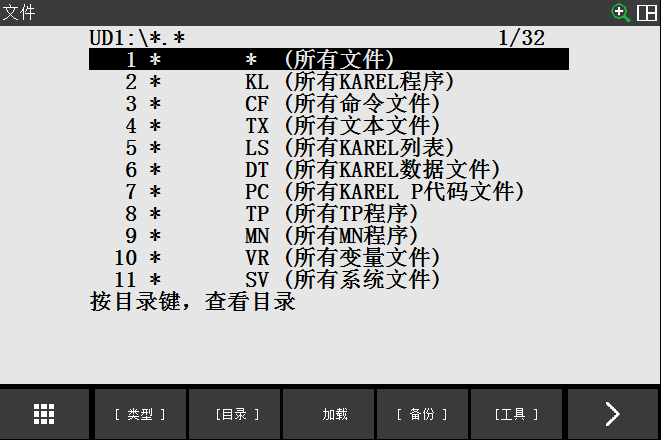
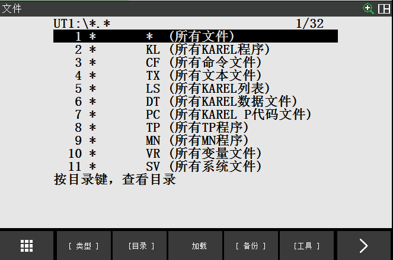
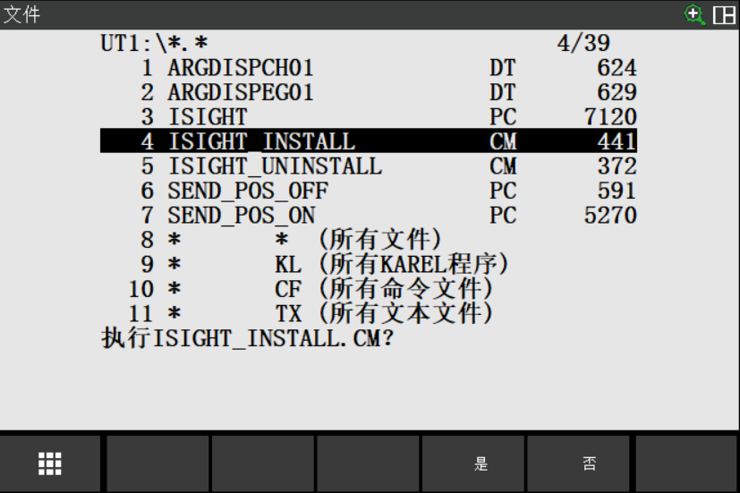
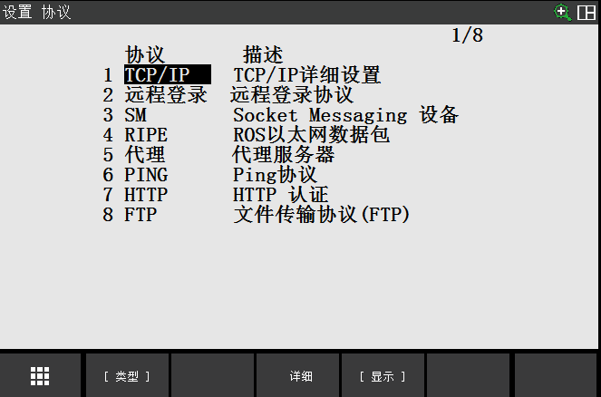
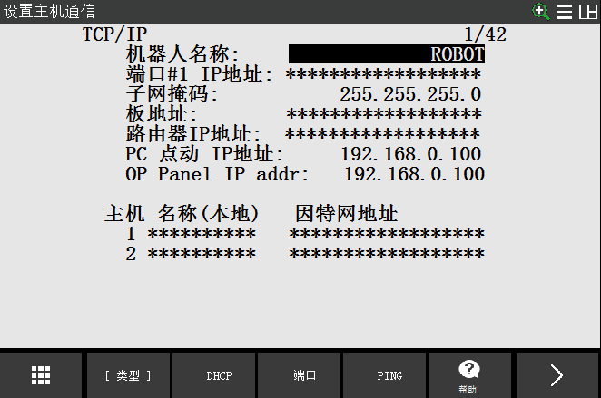
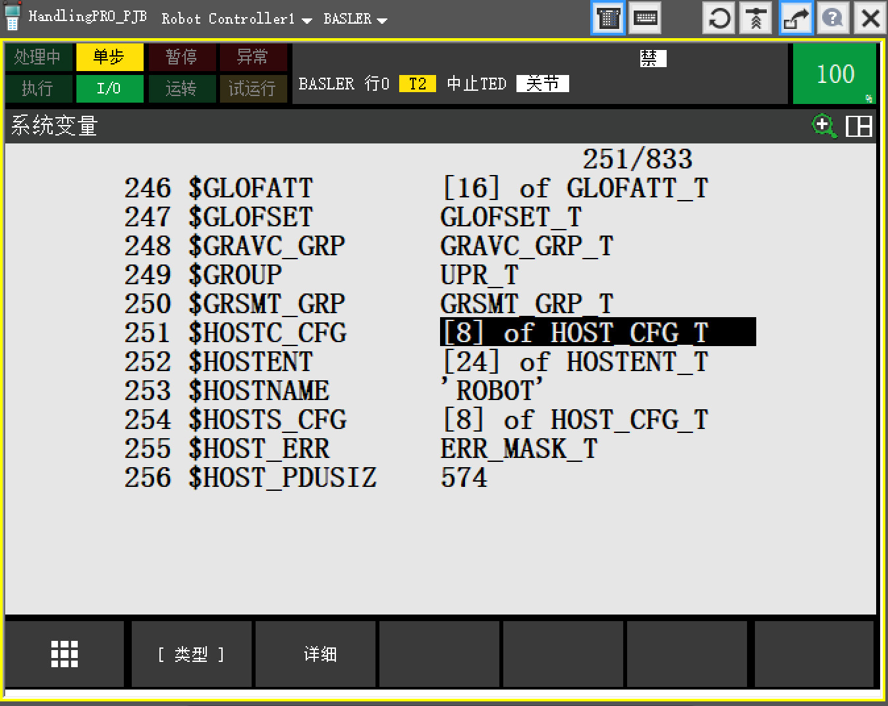
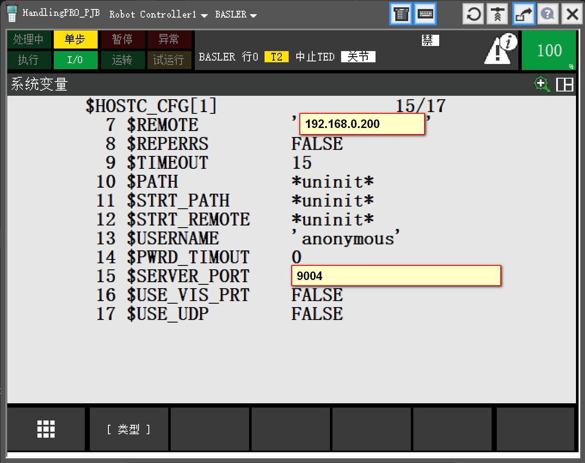
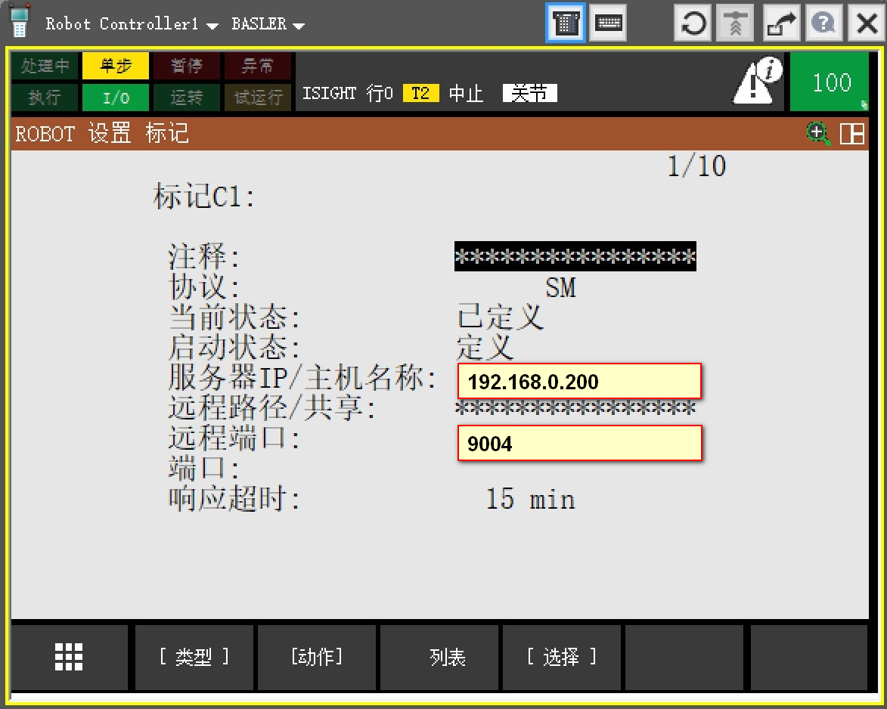
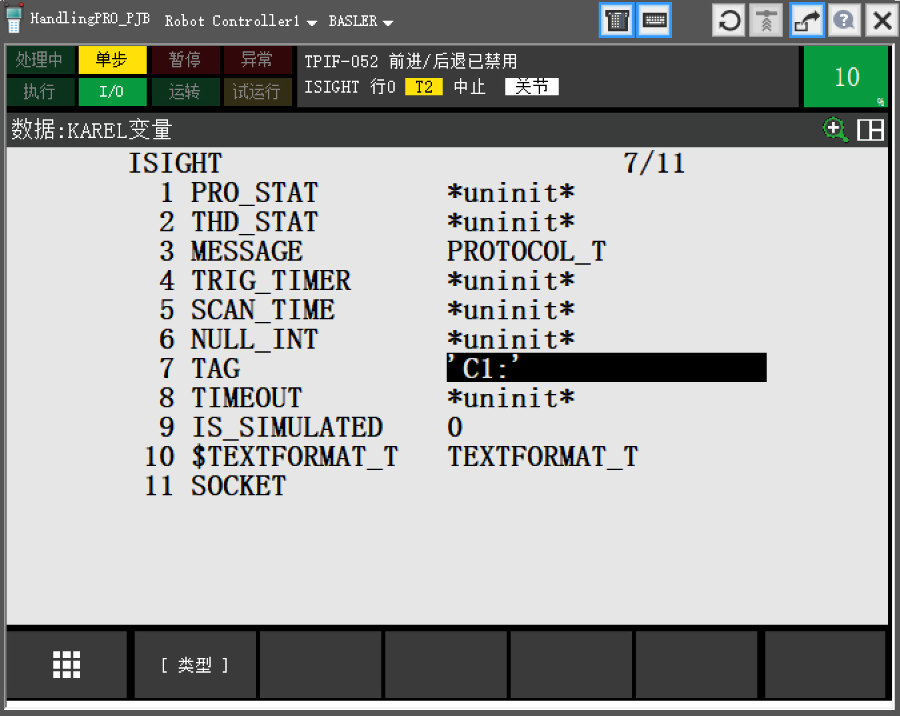

# iSight

#### 介绍
机器人KAREL ISIGHT在机器人TP编程时调用，用于机器人与上位机之间的通讯，主要包含视觉检测运行触发/结束信号、视觉检测结果请求、视觉检测设备掉线监测等功能。

#### 系统要求
* 硬件：ISIGHT软件与使用TCP/IP网络协议的所有网络硬件配置兼容。

* 软件：ISIGHT软件与所有其他因特网选项兼容，包括DNS、FTP、Web服务器和Telnet。

机器人系统需要安装选项：R648   User Socket Msg

**软件安装包：**ISIGHT、ISIGHT_INSTALL、ISIGHT_UNINSTALL、SEND_POS_ON、SEND_POS_OFF

#### 使用说明

1. 将软件安装包内的7个文件拷贝到可移动存储装置的根目录下。这里假设软件已经存储在USB存储器的根目录下。将USB存储器插入机器人示教器上的USB插槽中。在机器人示教器上，按MENU-> FILE/文件-> FILE/文件，按ENTER键进入，画面如下：

   

2. 按F5 [UTIL/工具]键，选择Set Device/切换设备，7)  根据存储介质选择对应选项。光标选择“TP上的USB（UT1:）”，按ENTER键进入：

   

3.  打开文件夹根目录（即安装包所在的目录），选择文件INSTALL，按 [ENTER/回车] 键，提示行将显示：“执行ISIGHT_INSTALL.CM？”

   

4. 按F4 [YES/是]键，界面显示 “Isight software install successfully”，即表示安装成功，查看程序列表，确认ISIGHT.PC、SEND_POS_OFF.PC、SEND_POS_ON.PC存在。

### 程序运行环境部署

1）机器人的TCP/IP设置

在机器人示教器上，按MENU键，选择SETUP/设置--> Host Comm/主机通讯，按ENTER进入“SETUP Protocols/设置 协议”界面：



选择TCP/IP，按ENTER键或F3 [DETAIL/详细] 键，进入“SETUP Host Comm/设置主机通信”界面：



在“Port#1 IP addr/端口#1 IP地址”项，输入机器人的IP地址。PC端（工控机）和机器人的IP地址需在同一网段（建议使用机器人IP：192.168.0.201）。完成设定后，重启机器人控制器。

**注：默认软件安装时工控机IP：192.168.0.200；软件监听端口：9004**

2）机器人设定作为客户端

在机器人TP中，打开系统变量，找到名为$HOSTC_CFG的变量（该变量作用就是告诉需要连接的主机配置，也就是服务器地址），如下图所示：



打开\$HOSTC_CFG变量，会出现一个变量列表，总共有8个变量，选择第一个变量并打开，设置远端服务器地址以及端口号（和前面在工控机端设置的一致，即\$REMOTE：192.168.0.200；\$SERVER_PORT；9004），并将PROTOCOL设置为'SM'：



前面设置的\$HOSTC_CFG变量，需要在MENU->设置->主机通讯->显示->客户端->C1中启用，主要是将当前状态和启动状态分别改为已定义和定义，此外需要检查协议是否为SM，如果不是，需要手动修改，如下图所示：



在isight.pc中设置KAREL变量，告诉KAREL程序，在连接服务器时候，应该使用\$HOSTC_CFG[1]中的地址（如果上一步设置的是第一个\$HOSTC_CFG变量）。设置步骤为：在TP中打开程序列表-->选中名为ISIGHT的KAREL程序-->按下TP上DATA查看KAREL变量-->设置TAG变量值为C1:（C1代表使用\$HOSTC_CFG[1]中地址），具体如下图所示：



#### 演示测试程序

TP测试程序如下：

````
CALL ISIGHT(0, is_simulate = 0, tag = 'C1:', time_out = 5000, task_status = 1，connect_status = 1) 	  # iSight连接配置
CALL ISIGHT(1)			# iSight：机器人与服务器连接，使用全局time_out
CALL ISIGHT(3, 38, ProgIdx = XX)	# ActionID=38 (0x26)，机器人TP告诉AI Box，当前运行底涂工件的程序号ProgIdx，使用全局time_out
CALL ISIGHT(3, 1)		# ActionID=1，机器人发送CycleOn请求，使用全局time_out
# ========== 机器人运行底涂轨迹 ============== #
CALL ISIGHT(3, 2)		# ActionID=2，机器人发送CycleOff请求，使用全局time_out
wait 1.0				# 等待1s结果
CALL ISIGHT(3, 39, R_ID = XX, vision_time_out = 5000)	# ActionID=39 (0x27)，机器人向AI Box请求视觉检测结果，存放于R_ID=XX，如果超时vision_time_out未收到响应，寄存器R[R_ID]=404，并且连接状态寄存器R[connect_status]=0
CALL ISIGHT(2)			# iSight：机器人与服务器断开，使用全局time_out
````
